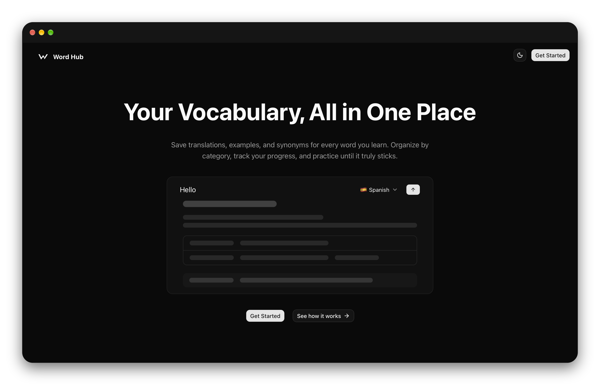

# Word Hub

**Your vocabulary, all in one place.**

Save translations, examples, and synonyms for every word you learn. Organize them by category, track your progress, and practice until it sticks.

[Live demo](https://word-hub-roan.vercel.app/)



## Features

- **Rich word entries**: translation, description, synonyms, antonyms, examples, and more
- **Categories**: group words and practice by topic
- **Word of the day**: a new word each day with meaning, example, and pronunciation
- **Progress tracking**: practice activity over the last 7 days and a mastered / in progress / new breakdown
- **Six practice modes**: match, guess, fill in the blank, write, synonym, antonym
- **Share & import**: export a category and import ones made by others
- **AI assist**: auto-fill word details and spelling suggestions

<!-- Features screenshots: add one or more -->
<!--  -->
<!--  -->

## Tech stack

- [Next.js](https://nextjs.org) (App Router), React, TypeScript
- Tailwind CSS, shadcn/ui, Radix UI, Motion
- Supabase (auth and database)
- TanStack Query, Zustand
- React Hook Form, Zod
- Vercel AI SDK with Google and Groq models
- Recharts

## Getting started

**Requirements:** Node.js 20+, [pnpm](https://pnpm.io), and a [Supabase](https://supabase.com) project.

```bash
git clone https://github.com/mehrnazkhani/word-hub.git
cd word-hub
pnpm install
```

Create a `.env.local` file in the project root:

```env
NEXT_PUBLIC_SUPABASE_URL=
NEXT_PUBLIC_SUPABASE_ANON_KEY=
GOOGLE_GENERATIVE_AI_API_KEY=
GROQ_API_KEY=
```

Start the development server:

```bash
pnpm dev
```

Open [http://localhost:3000](http://localhost:3000).

## Scripts

| Command      | Description                  |
| ------------ | ---------------------------- |
| `pnpm dev`   | Start the development server |
| `pnpm build` | Create a production build    |
| `pnpm start` | Run the production build     |
| `pnpm lint`  | Run ESLint                   |

## Project structure

```
app/          Routes and layouts
components/   Shared UI components
features/     Feature modules (words, categories, practice, ...)
hooks/        Custom hooks
lib/          Clients and utilities
queries/      Data fetching
schemas/      Zod schemas
types/        TypeScript types
```
